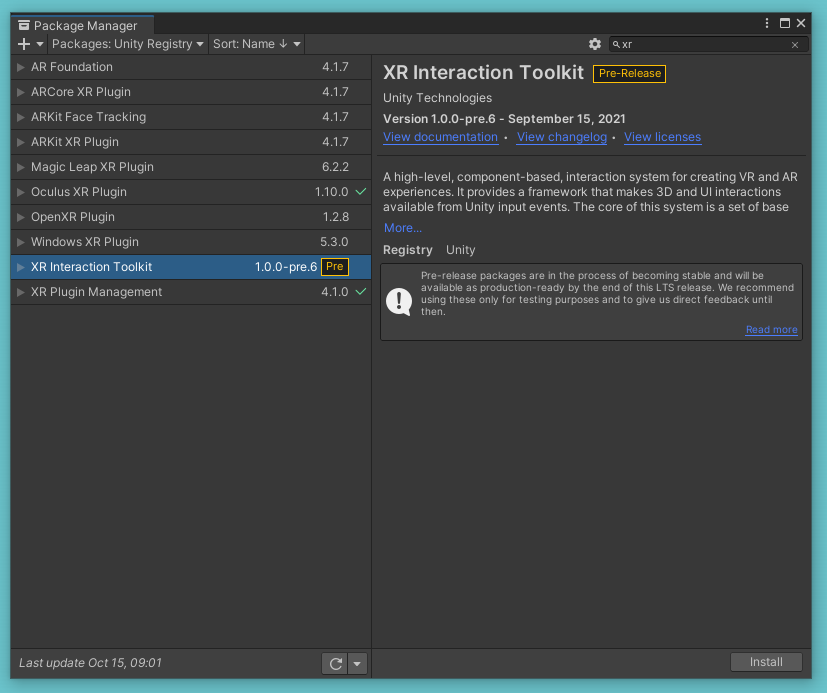

# How to Build to Oculus Quest from Unity

## A. Prerequisites - This has already been done for you for this session

* Unity installed, including android build support module.
* Oculus Quest setup, with developer mode activated
	[https://developer.oculus.com/documentation/native/android/mobile-device-setup/](https://developer.oculus.com/documentation/native/android/mobile-device-setup/)

## B. Setup Unity -  The Less interesting bit

1. ### Create a new Unity project
	* Open Unity Hub, create a new 3D project.

1. ### Switch platform to Android
	* Go to **file >Build Settings**
	* Select **Android**
	* Select **Switch Platform**
	
	
	
2. ### Install XR Plugin Management
	* Still in the Build Setting page, select **Player Settings**
	* Select **XR Plugin Management** and then **Install XR Plugin Management**
	
	
	
	* Once installed, select the Android tab, and check the **Oculus box** ( you may have less tabs then the image bellow)
	
	

3. ### Install XR Interactions
	* Still in Project Settings, select **Package Manager**
	* Check the box the says **Enable Pre-release Packages**, you will then be asked to confirm you understand the implication

	
	
	* Close the **Project Settings** panel, and the **build settings** menu
	* Go to **Window > Package Manager**

	
	
	* In Package Manager, select **Unity Registry** from the top 
	* Search for **XR Interaction Toolkit**, select it and press **Install**. When finished, Unity will need to restart

	

## C. Setup VR rig - Much more interesting

1. ### Add XR rig to scene
	* Go to **GameObject** > **XR** > **Device-Based** > **XR Rig**
	
	
	
2. ### Add a ground plane to the scene
	* Go to **GameObject** > **3D Object** > **Plane**
	
	
	
	* If you like, give the Ground a new material

3. ### Prepare the Headset
	* Now is a good time to test build your project on your Quest
	* Plug your Quest into the computer using the USB cable
	* You will now need to put on the Quest, and accept the connection
	
4. ### Build the project in Unity 
	* Go to **File** > **Build Settings**
	* Press the **Refresh** button to allow Unity to find your headset
	* Select your headset from the **Run Device** dropdown, it should say **Oculus Quest ** and then a number in brackets

	

	* Press **Build And Run**
	* Choose a location to build ( it can be anywhere you like) and give it a name ( you can name it anything)
	* Your project should now build and run in your headset
	* If everything worked correctly your simple scene should be showing in the headset.

## D. Add Hands (sort of)

1. ### Import objects from Blackboard
	* Go to blackboard and download the food unity package
	* Drag it into the assets panel in Unity
	
2. ### Add prefab to controllers
	* Choose one of the Food items ( or make a simple prefab shape)
	* Drag it onto the **Model Prefab** box on both controllers

	
	
	* Test your project

## E. Add Motion

1. ### Add rotation
	* Go to **GameObject** > **XR** > **Device-Based** > **Locomotion System** component to the scene

	

	* Drag the XR Rig onto the XR Rig box in the locomotion System
	* Drag one of your controllers from your rig, into the Controllers List in the **snap turn provider** component. This will allow you to rotate the camera using the controller
   
	
	
	* Build your project and then experiment with different values
	
2. ### Add teleportation
	* Add **Teleportation Area** component to your plane
	
	 
		
	* Build the project and try to teleport around the plane
	* You can also add teleportation Anchors. Go to **GameObject** > **XR** > ** Teleportation Anchor** , move the anchor away from your main ground plane and rescale it. you can add these to allow the user to teleport to specific points.
	* Add a few teleportation anchors to your scene
	* Build your scene again and test it

3. ### Add controller movement
	* An alternative method of movement is to use continuous movement, add the **Continuous Move Provider (Device-based)** component to the locomotion system

	

	* You will need to add a controller from your XR rig to the Controllers list on the component.

## F. Interact with other objects

1. ### Add Grabbables
	* Add an object or shape to the scene ( maybe one of the food objects :) )
	* Made sure the object has a **Box Collider** and **Ridgid body** component
	* Add an **XR Grab Interactable** component to the shape

	

	* You will now be able to pick up and throw the object using the grip button on the controller
	* Build your scene to test this out.

2. ### Add Audio and haptic events feedback
	
	* Open the **Left** or **RightHand Controller** in the **XR Rig** in the Hierarchy
	* Scroll down to the **XR Ray Interactor** in the inspector
	* Open the **Audio Events** Section and tick one or the event, then add a sound clip
	* You can get sound clips from [https://sfxr.me/](https://sfxr.me/)
	* You can add Haptic (vibration) events in bellow in the same way

## G. See what you can build yourself

